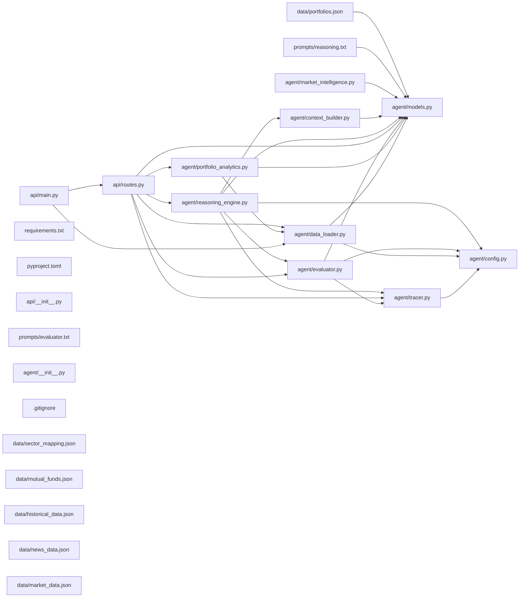

## ARCHITECTURE

A python-based project composed of the following subsystems:

- **agent/**: Primary subsystem containing 10 files
- **data/**: Primary subsystem containing 6 files
- **tests/**: Primary subsystem containing 4 files
- **api/**: Primary subsystem containing 3 files
- **Root**: Contains scripts and execution points

## ENTRY_POINTS

*No entry points identified within budget.*

## SYMBOL_INDEX

**`agent/models.py`**
- class `StockData`
- class `IndexData`
- class `NewsEntities`
- class `NewsItem`
- class `SectorPerformance`
- class `Holding`
- class `MutualFundHolding`
- class `Portfolio`
- class `ConcentrationRisk`
- class `AssetMix`
- class `PortfolioAnalytics`
- class `MarketContext`
- class `CausalChain`
- class `ConflictSignal`
- class `ReasoningOutput`
- class `EvaluationResult`
- class `AgentResponse`

**`agent/tracer.py`**
- `get_langfuse_client()`
- `create_trace()`
- `log_generation()`

**`agent/config.py`**
- class `Settings`

**`agent/data_loader.py`**
- `preload_data()`
- `_derive_overall_sentiment()`
- `get_market_data()`
- `get_portfolio()`
- `get_all_portfolios()`
- `get_news()`
- `get_news_for_portfolio()`
- `get_sector_info()`
- `get_stock_data()`

**`api/main.py`**
- `lifespan()`

**`agent/portfolio_analytics.py`**
- `compute_analytics()`
- `_compute_sector_allocation()`
- `_detect_concentration_risk()`
- `_compute_asset_mix()`
- `_compute_day_pnl()`

**`agent/evaluator.py`**
- `_get_system_prompt()`
- `_call_groq()`
- `_parse_evaluation_json()`
- `evaluate_reasoning()`

**`api/routes.py`**
- `health_check()`
- `list_portfolios()`
- `get_market()`
- `get_analytics()`
- `analyze_portfolio()`

**`agent/reasoning_engine.py`**
- `_get_system_prompt()`
- `_call_groq()`
- `_parse_reasoning_json()`
- `generate_briefing()`

**`agent/context_builder.py`**
- `build_reasoning_context()`

**`agent/market_intelligence.py`**
- `compute_market_sentiment()`
- `get_top_movers()`
- `summarize_fii_activity()`

## IMPORTANT_CALL_PATHS

main.lifespan()
  → data_loader.preload_data()
  → models.StockData()
## CORE_MODULES

### `agent/models.py`

**Purpose:** All Pydantic v2 domain models for finwise-agent. No model is defined elsewhere.

**Types:**
- `AgentResponse` (bases: `BaseModel`) - Full response returned by the /analyze endpoint.
- `AssetMix` (bases: `BaseModel`) - Percentage split between direct stocks and mutual funds.
- `CausalChain` (bases: `BaseModel`) - A causal chain linking a news trigger to portfolio impact.
- `ConcentrationRisk` (bases: `BaseModel`) - Sector concentration risk assessment for a portfolio.
- `ConflictSignal` (bases: `BaseModel`) - A conflicting signal where news sentiment and price action diverge.
- `EvaluationResult` (bases: `BaseModel`) - Quality scores for a reasoning output, produced by the evaluator LLM.

**Notes:** decorator-heavy (6 decorators)

### `agent/tracer.py`

**Purpose:** Langfuse tracing setup — never propagates exceptions to callers.
**Depends on:** `config`

**Functions:**
- `def create_trace(name: str, portfolio_id: str) -> StatefulTraceClient`
  - Create and return a new Langfuse trace for the given name and portfolio.
- `def get_langfuse_client() -> Langfuse`
  - Return the singleton Langfuse client, initializing it if needed.
- `def log_generation(trace: StatefulTraceClient, name: str, prompt: str, completion: str, model: str, ...) -> None`
  - Log a single LLM generation to the given trace. Never raises.

### `agent/config.py`

**Purpose:** Settings module — loads all configuration from environment via pydantic-settings.

**Types:**
- `Settings` (bases: `BaseSettings`) - Application-wide settings loaded from environment variables or .env file.

### `agent/data_loader.py`

**Purpose:** JSON loading and typed query interface — all data is read-only and loaded at startup.
**Depends on:** `config`, `models`

**Functions:**
- `def _derive_overall_sentiment(indices: list[IndexData]) -> str`
- `def get_all_portfolios() -> list[Portfolio]`
- `def get_market_data() -> MarketContext`
- `def get_news() -> list[NewsItem]`
- `def get_news_for_portfolio(portfolio: Portfolio) -> list[NewsItem]`
- `def get_portfolio(portfolio_id: str) -> Portfolio`
- `def get_sector_info(sector: str) -> SectorPerformance | None`
- `def get_stock_data(symbol: str) -> StockData | None`

## SUPPORTING_MODULES

### `api/main.py`

> FastAPI application entry point with lifespan data preloading.

```python
def lifespan(app: FastAPI) -> AsyncGenerator[None, None]
    """Preload all JSON data at startup; no teardown required."""

```

### `agent/portfolio_analytics.py`

> Portfolio analytics — pure computation of P&L, allocation, and risk metrics.

```python
def compute_analytics(portfolio: Portfolio, market_context: MarketContext) -> PortfolioAnalytics
    """Compute full analytics for a portfolio given current market context."""

def _compute_sector_allocation(portfolio: Portfolio) -> dict[str, float]
    """Compute sector allocation percentages from direct stock holdings only."""

def _detect_concentration_risk(sector_allocation: dict[str, float]) -> ConcentrationRisk
    """Classify concentration risk based on highest single-sector exposure."""

def _compute_asset_mix(portfolio: Portfolio) -> AssetMix
    """Compute the percentage split between direct stocks and mutual funds."""

def _compute_day_pnl(portfolio: Portfolio) -> tuple[float, float]
    """Return (day_pnl_absolute, total_invested_value) across all holdings."""

```

### `agent/evaluator.py`

> Evaluator — second LLM call that scores reasoning output quality.

```python
def _get_system_prompt() -> str
    """Load and cache the evaluator system prompt from disk."""

def _call_groq(client: AsyncGroq, messages: list[dict]) -> tuple[str, dict]
    """Make a single Groq API call and return (content, usage_dict)."""

def _parse_evaluation_json(raw: str) -> EvaluationResult
    """Parse LLM response JSON into EvaluationResult; raises ValueError on failure."""

def evaluate_reasoning(
    reasoning: ReasoningOutput,
    analytics: PortfolioAnalytics,
    trace: StatefulTraceClient,
) -> EvaluationResult
    """Score a ReasoningOutput via a second Groq call, with one retry on JSON failure."""

```

### `api/routes.py`

> All FastAPI route handlers for finwise-agent.

```python
def health_check() -> dict
    """Return service health status."""

def list_portfolios() -> list[dict]
    """Return all portfolio IDs and owner names."""

def get_market() -> MarketContext
    """Return the current market context snapshot."""

def get_analytics(portfolio_id: str) -> PortfolioAnalytics
    """Return portfolio analytics without any LLM call (fast path)."""

def analyze_portfolio(portfolio_id: str) -> AgentResponse
    """Run the full agent pipeline: analytics + LLM briefing + evaluation."""

```

### `agent/reasoning_engine.py`

> Reasoning engine — calls Groq LLM to generate a causal portfolio briefing.

```python
def _get_system_prompt() -> str
    """Load and cache the reasoning system prompt from disk."""

def _call_groq(
    client: AsyncGroq,
    messages: list[dict],
) -> tuple[str, dict]
    """Make a single Groq API call and return (content, usage_dict)."""

def _parse_reasoning_json(raw: str, portfolio_id: str) -> ReasoningOutput
    """Parse LLM response JSON into ReasoningOutput; raises ValueError on failure."""

def generate_briefing(
    portfolio: Portfolio,
    analytics: PortfolioAnalytics,
    market_context: MarketContext,
    relevant_news: list,
    trace: StatefulTraceClient,
) -> ReasoningOutput
    """Generate a causal portfolio briefing via Groq, with one retry on JSON failure."""

```

### `agent/context_builder.py`

> Assembles a structured plain-text context block for LLM consumption.

```python
def build_reasoning_context(
    portfolio: Portfolio,
    analytics: PortfolioAnalytics,
    market_context: MarketContext,
    relevant_news: list[NewsItem],
) -> str
    """Produce a structured plain-text block for injection into the LLM reasoning prompt."""

```

### `agent/market_intelligence.py`

> Pure computation module for market-level intelligence — no LLM calls.

```python
def compute_market_sentiment(market_context: MarketContext) -> str
    """Return BULLISH, BEARISH, or NEUTRAL based on index movements and market breadth."""

def get_top_movers(market_context: MarketContext, n: int = 3) -> dict[str, list[SectorPerformance]]
    """Return the top n sector gainers and losers by day_change_percent."""

def summarize_fii_activity(market_context: MarketContext) -> str
    """Return a human-readable summary of FII net activity from market context."""

```

## DEPENDENCY_GRAPH



## RANKED_FILES

| File | Score | Tier | Tokens |
|------|-------|------|--------|
| `agent/models.py` | 0.458 | structured summary | 184 |
| `agent/tracer.py` | 0.226 | structured summary | 145 |
| `agent/config.py` | 0.213 | structured summary | 51 |
| `agent/data_loader.py` | 0.198 | structured summary | 164 |
| `api/main.py` | 0.125 | signatures | 52 |
| `agent/portfolio_analytics.py` | 0.120 | signatures | 187 |
| `agent/evaluator.py` | 0.120 | signatures | 171 |
| `api/routes.py` | 0.106 | signatures | 131 |
| `agent/reasoning_engine.py` | 0.089 | signatures | 197 |
| `agent/context_builder.py` | 0.081 | signatures | 81 |
| `agent/market_intelligence.py` | 0.081 | signatures | 141 |
| `tests/test_market_intelligence.py` | 0.081 | one-liner | 17 |
| `tests/test_data_loader.py` | 0.059 | one-liner | 15 |
| `tests/test_portfolio_analytics.py` | 0.050 | one-liner | 17 |
| `README.md` | 0.050 | one-liner | 10 |
| `prompts/reasoning.txt` | 0.050 | one-liner | 14 |
| `requirements.txt` | 0.026 | one-liner | 10 |
| `pyproject.toml` | 0.026 | one-liner | 12 |
| `tests/__init__.py` | 0.025 | one-liner | 13 |
| `api/__init__.py` | 0.025 | one-liner | 15 |
| `prompts/evaluator.txt` | 0.025 | one-liner | 14 |
| `data/portfolios.json` | 0.025 | one-liner | 12 |
| `agent/__init__.py` | 0.025 | one-liner | 15 |
| `.gitignore` | 0.025 | one-liner | 10 |
| `data/sector_mapping.json` | 0.000 | one-liner | 13 |
| `data/mutual_funds.json` | 0.000 | one-liner | 15 |
| `data/historical_data.json` | 0.000 | one-liner | 13 |
| `data/news_data.json` | 0.000 | one-liner | 12 |
| `data/market_data.json` | 0.000 | one-liner | 13 |

## PERIPHERY

- `tests/test_market_intelligence.py` — Tests for market_intelligence module.
- `tests/test_data_loader.py` — Tests for data_loader module.
- `tests/test_portfolio_analytics.py` — Tests for portfolio_analytics module.
- `README.md` — 161 lines
- `prompts/reasoning.txt` — 35 lines
- `requirements.txt` — 67 lines
- `pyproject.toml` — 44 lines
- `tests/__init__.py` — Tests package init.
- `api/__init__.py` — Package init for api module.
- `prompts/evaluator.txt` — 21 lines
- `data/portfolios.json` — 711 lines
- `agent/__init__.py` — Package init for agent module.
- `.gitignore` — 12 lines
- `data/sector_mapping.json` — 151 lines
- `data/mutual_funds.json` — 555 lines
- `data/historical_data.json` — 257 lines
- `data/news_data.json` — 566 lines
- `data/market_data.json` — 785 lines

